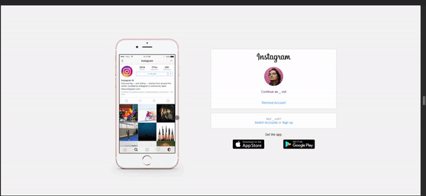

 
  

&#xa0;

<a href="https://viniciussoaresti.github.io/instagramClone/">👉Live Demo👈</a>

<h1 align="center">Instagram Clone</h1>

  

  

  

  

  

  

  

  <a href="#dart-about">About</a> &#xa0; | &#xa0; 
  <a href="#sparkles-features">Features</a> &#xa0; | &#xa0;
  <a href="#rocket-technologies">Technologies</a> &#xa0; | &#xa0;
  <a href="#memo-license">License</a> &#xa0; | &#xa0;
  <a href="https://github.com/viniciussoaresti" target="_blank">Author</a>

 

## :dart: About

Instagram's landing page clone, as seen on DIO's bootcamp 🤳

## :sparkles: Features

Base project:

:heavy_check_mark: Responsive;\
:heavy_check_mark: HTML, CSS and JS only;

My personal contributions:

:heavy_check_mark: Favicon;\
:heavy_check_mark: English translation;\
:heavy_check_mark: Hosted on Netlify;\
:heavy_check_mark: Compressed images to reduce latency;\
:heavy_check_mark: Made the buttons' actions and animations, and media query transitions just for fun;\
:heavy_check_mark: Fixed the buttons' style when too little;

## :rocket: Technologies

The following tools were used in this project:

- [HTML](https://developer.mozilla.org/pt-BR/docs/Web/HTML)
- [CSS](https://developer.mozilla.org/pt-BR/docs/Web/CSS)
- [JS](https://developer.mozilla.org/pt-BR/docs/Web/Javascript)
- [Favicon.IO](https://favicon.io/)
- [Netlify](https://www.netlify.com/)

## :memo: License

This project is under license from MIT. For more details, see the [LICENSE](LICENSE.md) file.

Made with :heart: by <a href="https://github.com/viniciussoaresti" target="_blank">Vinícius Soares</a> and inspired by <a href="https://github.com/SpruceGabriela" target="_blank">Gabriela Pinheiro's </a> Instagram's Clone, which you can find <a href="https://github.com/SpruceGabriela/instagram-dio" target="_blank">here</a>.

&#xa0;

<a href="#top">Back to top</a>
